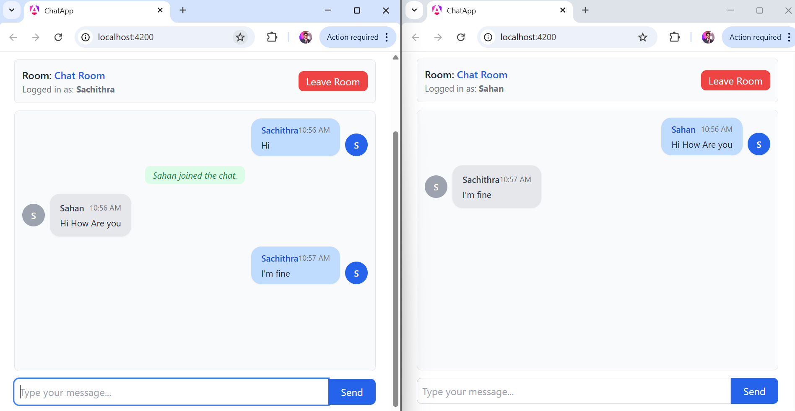

# ChatApp - Real-Time Chat Application

A modern, real-time chat application built with Angular and .NET, featuring WebSocket communication via SignalR for instant message delivery.

## Project Overview

ChatApp is a full-stack web application that allows users to join chat rooms and communicate in real-time with other users. The application demonstrates modern web development practices with a responsive frontend and a robust backend API.

## Tech Stack

### Frontend
- **Angular** - Modern web framework for building dynamic user interfaces
- **TypeScript** - Typed superset of JavaScript for better code quality
- **Tailwind CSS** - Utility-first CSS framework for rapid UI development
- **SCSS** - Preprocessor for advanced CSS styling
- **SignalR Client** - Real-time communication library for WebSocket connections

### Backend
- **.NET 9.0** - Modern, high-performance framework for building APIs
- **C#** - Modern, object-oriented programming language
- **SignalR** - Real-time bidirectional communication framework
- **ASP.NET Core** - Lightweight and cross-platform web framework

### Additional Tools
- **Node.js & npm** - JavaScript runtime and package manager
- **NuGet** - Package manager for .NET

## Features

✅ Real-time message delivery using WebSocket (SignalR)  
✅ Multiple chat rooms support  
✅ User presence detection (join/leave notifications)  
✅ Responsive and modern UI with Tailwind CSS  
✅ Cross-platform compatibility  

## Project Structure

```
ChatRoom/
├── chat-app/                 # Angular frontend application
│   ├── src/
│   │   ├── app/
│   │   │   ├── chat/        # Chat component
│   │   │   └── services/    # SignalR service
│   │   ├── main.ts          # Application entry point
│   │   └── styles.scss      # Global styles
│   ├── angular.json         # Angular configuration
│   ├── tailwind.config.js   # Tailwind configuration
│   └── package.json         # Node dependencies
│
└── ChatAppApi/              # .NET backend API
    ├── ChatHub.cs           # SignalR hub for chat
    ├── Program.cs           # Application configuration
    ├── appsettings.json     # Configuration settings
    └── ChatAppApi.csproj    # Project file
```

## Prerequisites

Make sure you have the following installed on your system:

- **Node.js** (v18 or higher) - [Download](https://nodejs.org/)
- **.NET 9.0 SDK** - [Download](https://dotnet.microsoft.com/download)
- **npm** (comes with Node.js)
- **Git** (for version control)

## Installation & Setup

### 1. Clone the Repository

```bash
git clone <repository-url>
cd ChatRoom
```

### 2. Frontend Setup (Angular)

Navigate to the frontend directory and install dependencies:

```bash
cd chat-app
npm install
```

### 3. Backend Setup (.NET)

Navigate to the backend directory and restore NuGet packages:

```bash
cd ChatAppApi
dotnet restore
```

## Running the Application

### Option 1: Running Both Servers Separately

#### Terminal 1 - Start the Backend API

```bash
cd ChatAppApi
dotnet run
```

The API will start on `https://localhost:5001` (or check the console for the exact URL).

#### Terminal 2 - Start the Frontend Application

```bash
cd chat-app
ng serve
```

The Angular app will be available at `http://localhost:4200`.

### Option 2: Running the Backend Only (if Frontend is Already Built)

```bash
cd ChatAppApi
dotnet run
```

## Usage

1. Open your browser and navigate to `http://localhost:4200`
2. Enter your username
3. Join the "Chat Room"
4. Start sending messages - they will appear in real-time for all connected users
5. Open multiple browser windows to simulate multiple users chatting

## Application Output

Here's a screenshot of the ChatApp in action with multiple users connected:



*The image shows two separate browser instances with different users (Sahan and Sachithra) communicating in real-time through the Chat Room.*

## Configuration

### Frontend Configuration

- **API Base URL**: Configure in `src/app/services/signalr.service.ts`
- **Tailwind CSS**: Customize in `tailwind.config.js`
- **Angular Settings**: Modify in `angular.json`

### Backend Configuration

- **CORS Settings**: Configure in `ChatAppApi/Program.cs`
- **SignalR Hub**: Located in `ChatAppApi/ChatHub.cs`
- **Application Settings**: Configure in `appsettings.json`

### Environment Variables

Create a `.env` file in the `chat-app` directory:

```env
API_URL=https://localhost:5001
```

## Development

### Frontend Development

- **Generate Component**: `ng generate component component-name`
- **Build**: `ng build`
- **Run Tests**: `ng test`
- **Lint**: `ng lint`

### Backend Development

- **Build**: `dotnet build`
- **Run Tests**: `dotnet test`
- **Clean Build**: `dotnet clean`

## Troubleshooting

### Connection Issues

1. **Ensure both servers are running** on the correct ports
2. **Check CORS settings** in the backend (Program.cs)
3. **Verify firewall settings** allow localhost connections
4. **Check browser console** for any error messages

### Port Already in Use

If port 4200 or 5001 is already in use:

```bash
# Frontend on different port
ng serve --port 4300

# Backend on different port
dotnet run --urls "https://localhost:5002"
```

### Module Not Found Errors

```bash
# Clear node_modules and reinstall
rm -r node_modules
npm install

# Or for .NET
dotnet clean
dotnet restore
```

## Build for Production

### Frontend Build

```bash
cd chat-app
ng build --configuration production
```

The built files will be in `chat-app/dist/`.

### Backend Publish

```bash
cd ChatAppApi
dotnet publish -c Release
```

The published files will be in `ChatAppApi/bin/Release/net9.0/publish/`.

---

**Happy Chatting!** 💬
